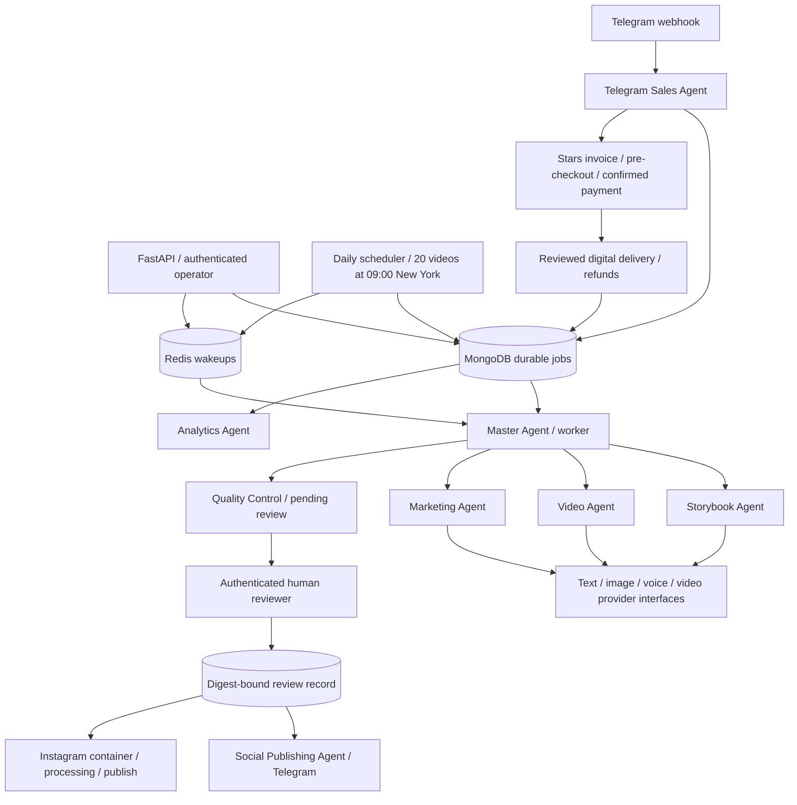

# Architecture

`api.py` validates input/authentication and persists job intentions. `agents.py` composes bounded provider calls and content state transitions. `jobs.py` owns atomic claim/lease/recovery. `worker.py` owns retries, deferred polls and terminal/uncertain states. `scheduler.py` owns timezone-aware frozen daily manifests, deduplicated date/slot jobs and automatic approved-video dispatch. `providers.py` owns transport and vendor-independent AI/Telegram contracts. `instagram.py` owns real container/poll/publish requests and publication locks. `payments.py` owns Stars orders, receipt deduplication, fulfilment and refunds. `safety.py` binds human decisions to exact content fields (including language/market for new content). `store.py` owns connectivity and index migrations v1/v2/v3.

MongoDB collections: `jobs`, `content`, `reviews`, `schema_versions`, `daily_batches` (v2), and `products`, `product_reviews`, `orders`, `payment_receipts`, `publications` (v3). Receipts use unique charge IDs; orders also have a partial unique charge index. `events` has a reserved workflow/time index for future additional audit events. Reviews, receipts, manifests and job/order timestamps are implemented audit evidence. MongoDB is the source of truth; Redis has no authoritative job state. Use durable MongoDB volumes or a managed replica set with appropriate write concern and backups for production.

Workflow generation optionally produces illustration/video/voice artifacts, then parent-facing marketing, and always enters `pending_review`. Approval is never generated by an AI. The human must inspect all modalities and suitability for the requested ages. A changed story, age range, marketing text, asset list or new-content locale/market changes the digest and invalidates approval. No public edit endpoint exists. Legacy Telegram channel publication is restricted to one destination per version; Instagram uses a separate per-account/content/version job. Storefront title/description/price are covered by a separate human-reviewed listing digest.

Scaling: add workers, monitor queue depth, and tune timeouts/lease length together. Keep the lease longer than the total bounded provider call time; the default 600 seconds covers the five 45-second generation calls. No provider call may have unbounded runtime. Provider-side idempotency is required. Use separate agent queues and budgets in a later revision if provider quotas require isolation.
