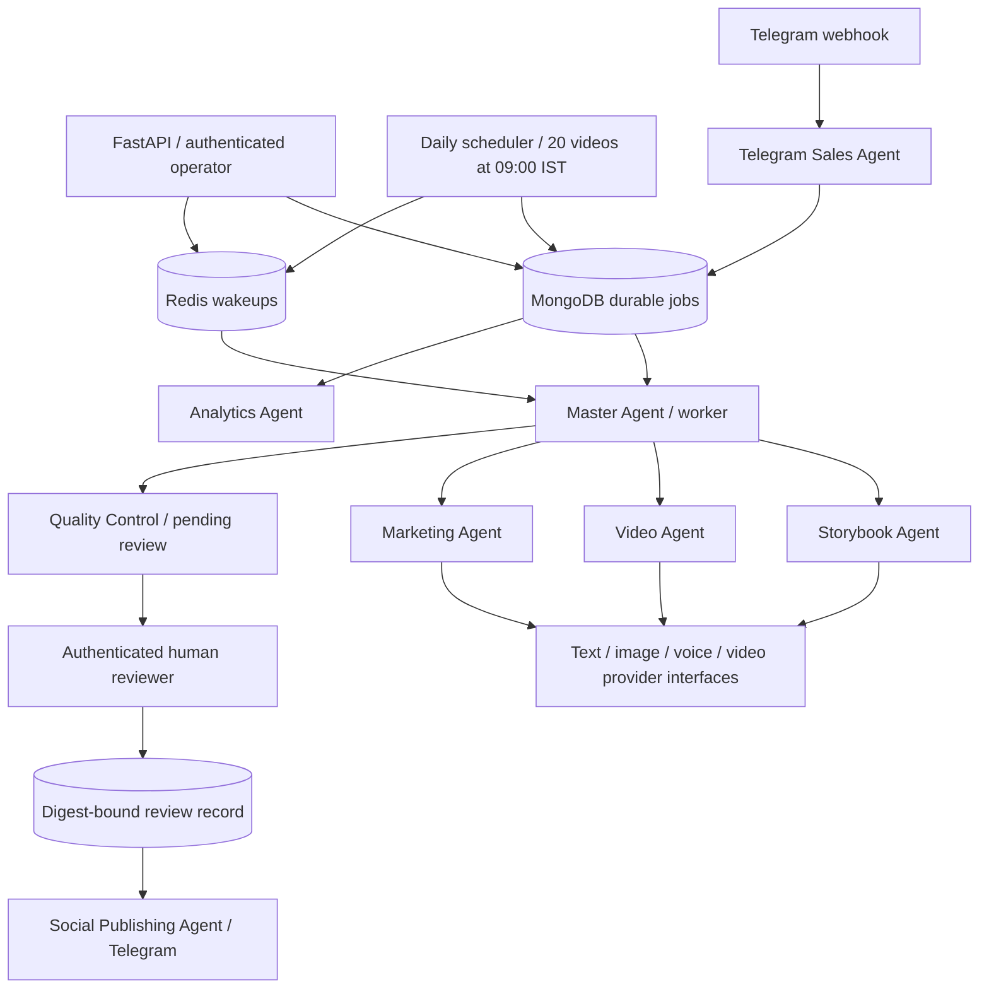

# Architecture

`api.py` validates input/authentication and persists job intentions. `agents.py` composes bounded provider calls and content state transitions. `jobs.py` owns atomic claim/lease/recovery. `worker.py` owns retries and terminal/uncertain state classification. `scheduler.py` owns frozen daily manifests and deduplicated date/slot jobs. `providers.py` owns transport and vendor-independent contracts. `safety.py` binds human decisions to exact content fields. `store.py` owns connectivity and index migrations v1/v2.

MongoDB collections: `jobs`, `content`, `reviews`, `schema_versions`, and `daily_batches` (migration v2); `events` has a reserved workflow/time index for future additional audit events. Reviews and job timestamps are the implemented audit evidence. MongoDB is the source of truth, Redis has no authoritative job state. Use durable MongoDB volumes or a managed replica set with appropriate write concern and backups for production.

Workflow generation optionally produces illustration/video/voice artifacts, then parent-facing marketing, and always enters `pending_review`. Approval is never generated by an AI. The human must inspect all modalities and suitability for the requested ages. A changed story, age range, marketing text or asset list changes the digest and invalidates approval. No public edit endpoint exists. Publication is restricted to one destination per content version in this foundation.

Scaling: add workers, monitor queue depth, and tune timeouts/lease length together. Keep the lease longer than the total bounded provider call time; the default 600 seconds covers the five 45-second generation calls. No provider call may have unbounded runtime. Provider-side idempotency is required. Use separate agent queues and budgets in a later revision if provider quotas require isolation.
